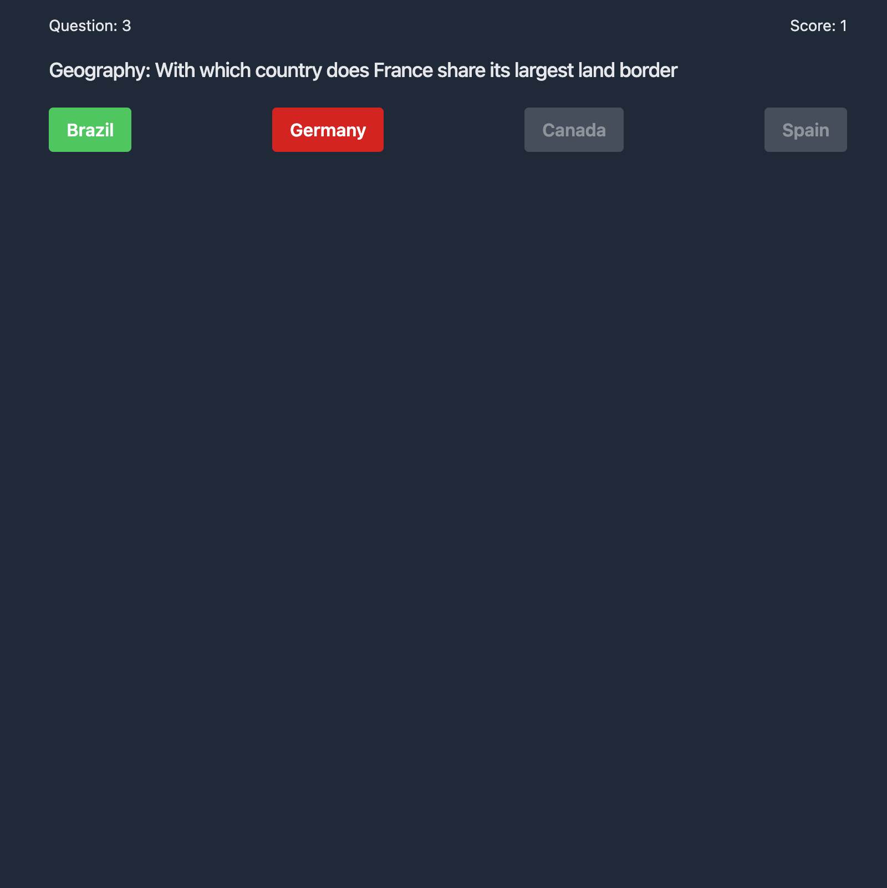

# README

A trivia game written in React and using questions from [Open Trivia DB](https://opentdb.com/).

Live URL: [mpleroux-trivia-quiz.netlify.app/](https://mpleroux-trivia-quiz.netlify.app/)

## Features

- Loads five multiple choice trivia questions from Open Trivia DB and provides buttons for answers
- Trivial Pursuit card artwork
- Question number and score are displayed in header
- Color-codes buttons based on result; green for correct, red for incorrect
- Waits 1.5 seconds and advances to the next question
- Displays final score and button to restart game

## Tech Stack

- React 19
- Vite
- TypeScript
- Tailwind CSS 4
- Open Trivia DB

## Improvements

- [ ] Styling and UI enhancements
- [ ] More comments

## Run locally

```sh
npm install
npm run dev # http://localhost:3000
```

## Screenshot


